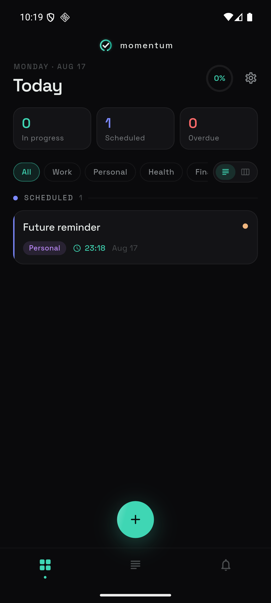
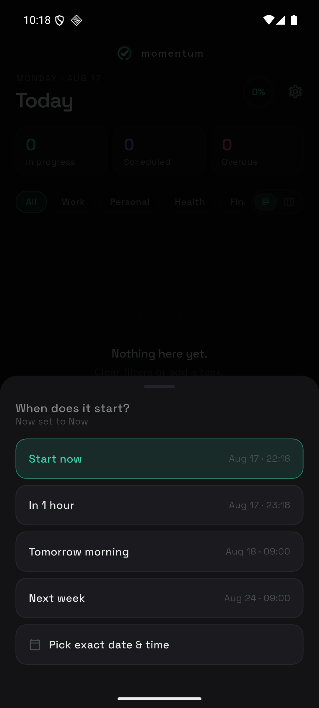

# Momentum

A personal Kanban for life. Offline-first, local-only, Android.

Every to-do app I tried wanted a start date, a due date, a project and a
priority before it would let me write down "call the bank". Momentum defaults to
**now** — you type the thing, it starts, it shows up under *In Progress*. Pushing
the start into the future is what makes something *Scheduled*, and that is the
only scheduling decision the app asks you to make.

<table>
  <tr>
    <td width="50%"></td>
    <td width="50%"></td>
  </tr>
  <tr>
    <td align="center"><em>Today, by status</em></td>
    <td align="center"><em>Every preset shows what it means</em></td>
  </tr>
</table>

## What it does

- **Starts now by default.** A new task lands in *In Progress*. Set a future
  start and it waits in *Scheduled* instead — the sheet tells you which, before
  you commit.
- **Scheduling in words, not timestamps.** "Start now", "In 1 hour", "Tomorrow
  morning" — each row shows the date and time it resolves to, so nothing is a
  guess. Due-date presets are measured from the start, so a deadline can never
  land before the task begins.
- **Reminders with something to say.** A task starting fires a real notification
  with a motivational line, not a bare title. Overdue tasks say so.
- **A nightly nudge.** Pick a time and Momentum tells you what is still in
  progress — task names and all, not just a count. Off by default; set it in
  Settings.
- **Promotes itself.** *Scheduled* becomes *In Progress* when its time arrives,
  and *In Progress* becomes *Overdue* when its due time passes — on a background
  job, on resume, and at launch.
- **Repeats.** Daily, weekly on chosen days, monthly with day clamping, or a
  custom interval. Completing a recurring task creates the next occurrence.
- **List or board.** Status-grouped list, or Kanban columns.
- **Updates itself.** Checks GitHub Releases once a day and offers the new build.

## Install

Grab the APK from
[**Releases**](https://github.com/Priyanshu2410/momentum-app/releases/latest)
and open it on an Android phone (Android 8.0+). You will need to allow installs
from your browser once.

After the first install, updates go straight over the top — the app tells you
when one is out.

## Build it yourself

```bash
flutter pub get
```

```bash
flutter run
```

Notifications only really behave on a physical device or emulator, not in tests.
`SETUP.md` has the full toolchain, the release-signing setup, and two traps that
only bite in release builds.

```bash
flutter test
```

## How it works

Plain layers, no framework ceremony:

| Layer | What lives there |
|---|---|
| `domain/` | `Task`, the enums, the repository interface. Pure Dart. |
| `data/` | Drift (SQLite) tables, DAOs, and the one repository that owns the write path. |
| `services/` | Notifications, the promotion scheduler, the update check. |
| `presentation/` | Riverpod providers, screens, widgets. |

Two decisions worth knowing:

- **The repository owns notifications.** Anything that changes *when* a task
  happens also fixes up its reminders in the same call, so the two cannot drift
  apart.
- **The promotion rule is one pure function.** `nextStatusFor` decides what a
  task's status should be at a given moment, and `statusForStart` decides what a
  new or snoozed task gets. Both are tested without a database or a device.

The logo is generated, not drawn — `tool/gen_icons.py` renders every launcher
and notification icon from one vector mark using nothing but the Python standard
library, and `MomentumMark` draws the same geometry in Dart.

## Notes

- **Android only** in practice. The iOS side is configured but unbuilt — no
  periodic background work there, so statuses catch up when you open the app.
- **No account, no cloud, no sync.** The database is a file on your phone.
  Uninstalling deletes it.
- Built for exactly one person's workflow. It is public because it might happen
  to fit yours.

Built with [Claude Code](https://claude.com/claude-code), which also found the
two release-only bugs that would have silently stopped every reminder in the app.
